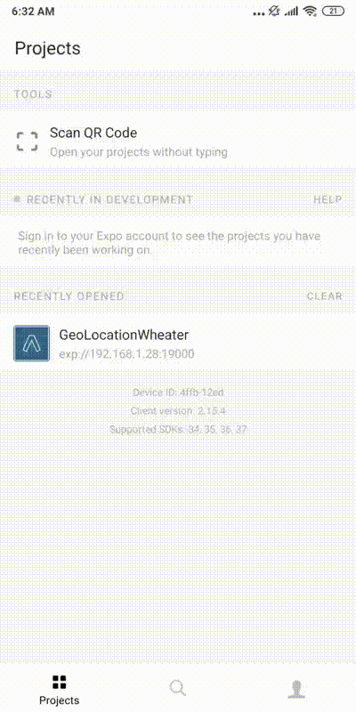

# React Native - Geolocation + Weather
This is a Basic project in React Native to capture user's location and get the current weather of that location from openweathermap API.

#### System running example:

### Requisits:
The project uses Expo and two modules to get smarthphone location:

expo install expo-permissions
expo install expo-location

The project uses OpenWeatherMap API to get the current weather based on the user's latitude and longitude.

You needs an API-KEY from OpenWeatherMap to use the Weather API, you can create a free account and put your API-KEY in the "APP.tsx" file.
The API call used in the project it's free and gives the weather about every 3 hours of the next 5 days, totalizing 40 blocks of weather info.
https://openweathermap.org/api
https://openweathermap.org/forecast5

### Install:

You can install by cloning this repository and running "yarn install" inside that directory.

### Running:

You can run this app by running "expo start" on a terminal, in the project directory.